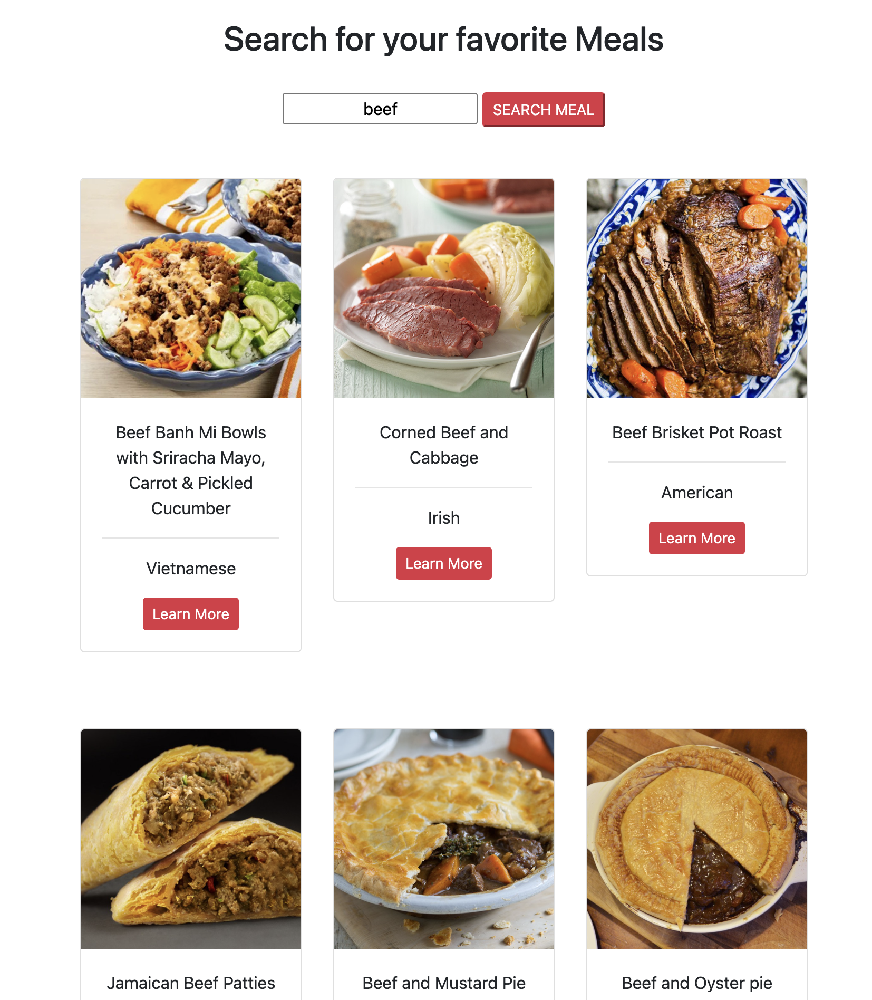

### Meal Suggestions App

Simple Django web-app to display recipies for searched keywords, for personal use.

Practise with Django Framework, SQL databased, public API usage, GitHub workflows.



---
To run locally
```
git clone meal_project
cd meal_project
python -m venv env
```
On Windows:
```
.\env\Scripts\activate
```
On Mac/Linux:
```
source env/bin/activate
```
Install packages and run server locally
```
pip install -r requirements.txt
pip install Django
python manage.py migrate
python manage.py runserver
```

You should see a server being started, directing you to navigate to the "Development server" at: 
`http://127.0.0.1:8000/`

---

This project was intended as practise for Django framework in combination with requesting data from public api. Build followed instructions from https://dev.to/yahaya_hk/how-to-populate-your-database-with-data-from-an-external-api-in-django-398i
